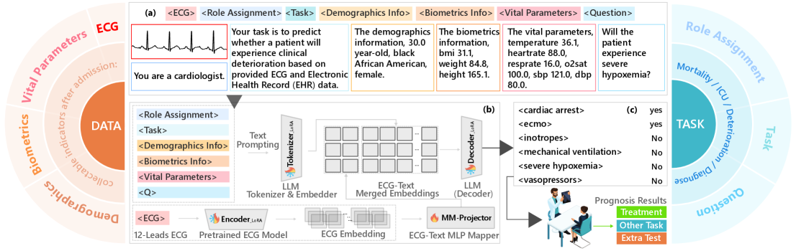

<div align="center">

# UniPACT

**A Multimodal Framework for Prognostic Question Answering on Raw ECG and Structured EHR**

[](https://ieeexplore.ieee.org/document/11461333)
[](https://arxiv.org/abs/2601.17916)
[](https://huggingface.co/datasets/jialucode/MIMIC_PROGNOSIS) <!-- replace <your-org> -->

Jialu Tang · Tong Xia · Yuan Lu · Aaqib Saeed — ICASSP 2026

</div>

<p align="center">
  
</p>

> *"Does this patient have hypertension?"* is **diagnosis**.
> *"Will this patient deteriorate within 24 hours?"* is **prognosis** — and that is what UniPACT answers.

UniPACT is a single multimodal LLM that fuses **raw 12-lead ECG waveforms** with **structured EHR** to answer **1443 binary prognostic questions** spanning diagnosis, deterioration, ICU admission, and mortality — all under one language-driven QA format.

## ✨ Why UniPACT

|  | **INFLEXIBLE** *(specialized prognosis models)* | **UNIFIED** *(UniPACT)* |
|---|---|---|
| Tasks | One task per model | **One model, all 1443 tasks** |
| Missing values | Fills gaps with zeros | **Uses only observed values** |
| Interface | Numeric I/O only | **Native language interface** |

## 📊 Results at a glance

**Beats the specialized SOTA with a single unified model.** On the MDS-ED benchmark (1443 prognostic sub-tasks):

| Method | Diagnosis | Deterioration | ICU | Mortality | **Overall** |
|---|---:|---:|---:|---:|---:|
| ECG-Chat | 49.70 | 57.54 | 56.40 | 55.78 | 54.86 |
| Q-HEART | 50.15 | 55.42 | 54.89 | 56.32 | 54.20 |
| MDS-ED *(prior SOTA, specialized)* | 82.56 | 90.70 | 90.63 | 91.68 | 88.90 |
| **UniPACT (ours)** | **83.98** | **91.17** | 90.50 | **91.82** | **89.37** |

*AUROC (%). MDS-ED uses two separately-trained networks; UniPACT uses one.*

See paper §3 for robustness analysis and §4 for ablations.

## 🚀 Quick start

```bash
# 1. Clone and install
git clone https://github.com/Tang-Jia-Lu/UniPACT.git
cd UniPACT
pip install -r requirements.txt
# Activate your Python environment however you prefer (conda / venv / module load)

# 2. Stage 0 -- one-time setup: download the four external assets listed in
#    "Setup" below (annotations, ECG encoder weights, MIMIC-IV-ECG signals,
#    MedGemma checkpoint).

# 3. Build per-class balanced training splits (yes/no balanced within each task)
python scripts/make_balanced_split.py --input-dir ./annotation \
    --output ./annotation/balanced_stage1_seed42.json --seed 42
python scripts/make_balanced_split.py --input-dir ./annotation \
    --output ./annotation/balanced_stage2_seed43.json --seed 43

# 4. Two-stage training and held-out test (SLURM)
sbatch 1_train.sh    # Stage 1: projector alignment
sbatch 2_train.sh    # Stage 2: LoRA fine-tuning
sbatch 3_test.sh     # Inference + AUC/Accuracy summary
```

The reported paper numbers come from this exact pipeline on the official
MDS-ED splits.

## 🛠 Setup

Four external assets are required before the Quick start commands work.
Each section below expands with the download location and target path.

<details>
<summary><b>1. Annotations</b> &mdash; LLaVA-format JSONs into <code>./annotation/</code></summary>

Download all `train_*.json` and `test.json` from
[`jialucode/MIMIC_PROGNOSIS`](https://huggingface.co/datasets/jialucode/MIMIC_PROGNOSIS/tree/main):

```
train_deterioration.json
train_diagnose_00.json ... train_diagnose_06.json
train_icu.json
train_mortality.json
test.json
```

Place them under `./annotation/`. Programmatic download (requires
`huggingface-cli login`):

```python
from huggingface_hub import hf_hub_download

path = hf_hub_download(
    repo_id="jialucode/MIMIC_PROGNOSIS",
    filename="train_deterioration.json",
    repo_type="dataset",
)
```

The two `balanced_stage*_seed*.json` files that `1_train.sh` /
`2_train.sh` consume are produced locally by
`scripts/make_balanced_split.py` (Quick start step 3) -- they are not on
HuggingFace. See [`annotation/README.md`](annotation/README.md) for the
full file list and per-task class counts.

**Custom splits.** To regenerate annotations under a different split, the
raw MDS-ED CSVs and the build script are bundled in the same HuggingFace
dataset:

```
mds_ed_train.csv  mds_ed_val.csv  mds_ed_test.csv  prepare_mds_ed_dataset.py
```

```bash
python prepare_mds_ed_dataset.py
```

Re-running reproduces the released JSON; pointing the script at your own
CSVs (same column schema) regenerates under your preferred split.

</details>

<details>
<summary><b>2. Pretrained ECG encoder weights</b> &mdash; <code>best.pt</code> into the encoder directory</summary>

Download `best.pt` from
[`jialucode/ZETA`](https://huggingface.co/jialucode/ZETA/blob/main/best.pt)
and save it as:

```
./llava/model/ecg_encoder/models/best.pt
```

This is the path referenced by `--ecg_encoder_dir` in all three SLURM
scripts. The architecture is built from the bundled
`llava/model/ecg_encoder/configs/config0.json`; only the weights file needs
to be obtained externally.

</details>

<details>
<summary><b>3. MIMIC-IV-ECG raw signals</b> &mdash; local PhysioNet WFDB tree</summary>

ECG waveforms are loaded via `wfdb` from a local copy of MIMIC-IV-ECG.
The dataset inherits the **PhysioNet Credentialed Health Data License**:

1. Create a [PhysioNet](https://physionet.org/) account
2. Complete the CITI "Data or Specimens Only Research" training
3. Sign the MIMIC-IV data use agreement

Once the WFDB tree is downloaded, point each SLURM script at the root:

```
--ecg_data_path /path/to/mimic-iv-ecg/files/
```

The dataset class expects the standard PhysioNet layout
`<root>/<patient_prefix>/<patient_id>/<study_id>/<study_id_no_s>.{dat,hea}`.

</details>

<details>
<summary><b>4. MedGemma checkpoint</b> &mdash; local copy of the base LLM</summary>

Download MedGemma from HuggingFace
([`google/medgemma-4b-it`](https://huggingface.co/google/medgemma-4b-it) or
your preferred variant) and pass the local path through
`--model_name_or_path` in `1_train.sh`, `2_train.sh`, and `3_test.sh`.

The smoke test in `llava/model/language_model/llava_gemma.py` reads the same
path from the `UNIPACT_MEDGEMMA_PATH` environment variable.

</details>

## 🧭 Where to go from here

- **New prognostic questions.** Add a `{prompt template, outcome label}` pair; no model changes required.
- **Additional modalities.** Train a parallel projector for PPG, EEG, chest X-ray, or lab time-series.
- **Alternative backbones.** Swap the ECG encoder or the base LLM for a different pretraining objective or open-weight model.
- **Better EHR textualization.** Replace fixed templates with learned or LLM-generated phrasings and richer feature sets.

## 📜 Citation

```bibtex
@INPROCEEDINGS{11461333,
  author    = {Tang, Jialu and Xia, Tong and Lu, Yuan and Saeed, Aaqib},
  booktitle = {ICASSP 2026 - 2026 IEEE International Conference on Acoustics, Speech and Signal Processing (ICASSP)},
  title     = {UniPACT: A Multimodal Framework for Prognostic Question Answering on Raw ECG and Structured EHR},
  year      = {2026},
  pages     = {22537-22541},
  doi       = {10.1109/ICASSP55912.2026.11461333}
}
```

## 🙏 Acknowledgements

Built on top of [MDS-ED](https://arxiv.org/abs/2407.17856), [MIMIC-IV-ECG](https://physionet.org/content/mimic-iv-ecg/), and [MIMIC-IV](https://physionet.org/content/mimiciv/).
